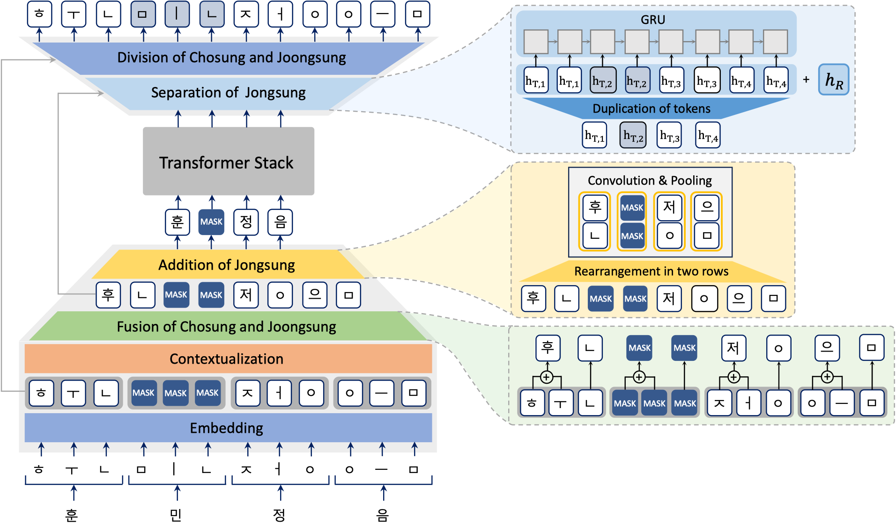
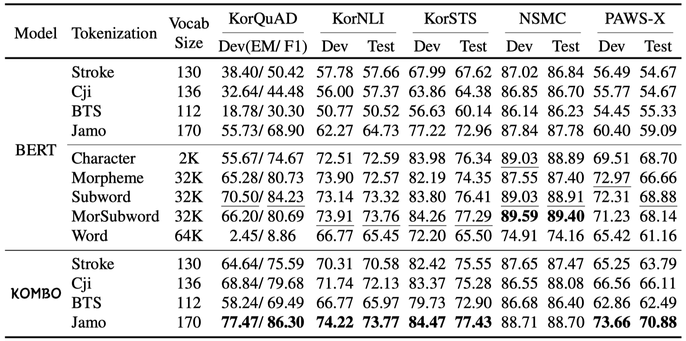
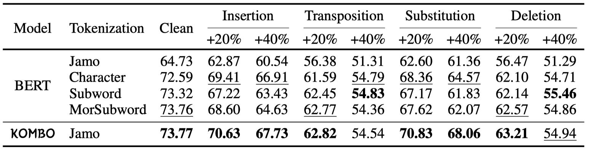

# KOMBO: Korean Character Representations Based on the Combination Rules of Subcharacters

This paper was accpeted in Findings of ACL 2024.
You can find the paper [here](https://aclanthology.org/2024.findings-acl.302).

</br>

<!-- TABLE OF CONTENTS -->
<h2>Contents</h2>
<ol>
  <li>
    <a href="#environment_installation">Environment Installation</a>
  </li>
  <li>
    <a href="#experimental_settings">Experimental Settings</a>
    <ol>
      <li><a href="#corpus">Corpus</a></li>
      <li><a href="#tokenization_baselines">Tokenization Baselines</a></li>
      <li><a href="#building_vocabulary">Building vocabulary</a></li>
    </ol>
  </li>
  <li>
    <a href="#pretraining">Pre-training</a>
    <ol>
      <li><a href="#pretraining_data">Datasets</a></li>
      <li><a href="#run_pretraining">Run Training</a></li>
      <li><a href="#pretrained_models">Baselines</a></li>
    </ol>
  </li>
  <li>
    <a href="#standard_korean_datasets">Standard Korean Datasets</a>
    <ol>
      <li><a href="#nlu_datasets">Datasets</a></li>
      <li><a href="#nlu_finetuning">Fine-tuning</a></li>
    </ol>
  </li>
  <li>
    <a href="#noisy_korean_datasets">Noisy Korean Datasets</a>
    <ol>
      <li><a href="#typo_finetuning">Fine-tuning</a></li>
    </ol>

  </li>
  <li>
    <a href="#offensive_datasets">Offensive Language Datasets</a>
    <ol>
      <li><a href="#offensive_data">Datasets</a></li>
      <li><a href="#offensive_finetuning">Fine Tuning</a></li>
    </ol>
  </li>
</ol>
<br/>
<br/>

#### Overall illustration of KOMBO where the input is "훈민정음" which has four characters and twelve subcharacters.


<br/>
<br/>

<a id="environment_installation"></a>
## 1. Environment Installation
- Create your virtual environment.
  ```bash
  conda create -n {your_env} python=3.8
  conda activate {your_env}
  
  pip install --upgrade pip
  ```
- Set the experiment environments.
  - Install the libraries including MeCab. (When you install the MeCab, you might have to join with a root account.)
  ```bash
  bash bash_scripts/installation/env_setting.sh
  ```
<br/>


<a id="experimental_settings"></a>
## 2. Experimental Settings
<a id="corpus"></a>
### i. Corpus

* You can download and preprocess all datasets at once.
  ```bash
  bash install_pipeline.sh
  ```
  If you want to do each steps separately, then you just follow the below steps.<br/>
  - Wiki dataset
    ```bash
    bash bash_scripts/installation/download_wiki.sh

    bash bash_scripts/installation/clean_wiki.sh
    ```  
  - Namu Wiki dataset
    ```bash
    bash bash_scripts/installation/download_namu.sh

    bash bash_scripts/installation/clean_namu.sh
    ```
* Dataset preprocessing

  | Corpus                   | Remove HTML tags  | Remove Empty space  | Punctuation Mapping  | ONLY_REMAIN (Korean/English/Punct)          |
  | :----------------------: | :---------------: | :-----------------: | :------------------: | :----------------------------------------:  |
  | Korean Wiki              | O                 | O                   | O                    | O <br/>(for building vocabulary)            |
  | English Wiki             | O                 | O                   | X                    | X                                           |
  | Namu Wiki                | O                 | O                   | O                    | O <br/>(same as Korean Wiki)                |

  <details>
  <summary>More Detailed Preprocessing Steps for Wiki dataset</summary>
  <ol>
    <li>
    <a>You can download the dump datasets used for pretraining below.</a>
      <ul>
        <li><a href=https://dumps.wikimedia.org/kowiki>Korean Wikipedia</a></li>
        <li><a href=https://dumps.wikimedia.org/enwiki>English Wikipedia</a></li>
      </ul>
    </li>
    <li>
      <a>Then we refine the dump dataset via <a href=https://github.com/attardi/wikiextractor>attardi/wikiextractor</a>.<br/>
        We use the latest version of the wiki dump datasets, which is referred as 20220923, and we utilize the 0.1 version of the wikiextractor.
      </a>
      
      python -m wikiextractor.WikiExtractor {Wiki dump file path} -o {output dir}
      
      cat {otuput_dir}/*/* > {final output_file}.txt
    </li>
    <li>
      <a>After applying the wikiextractor to wiki dump data, we appy the <a href=tokenization/scripts/clean_str.py>clean_str.py</a> for preprocessing the corpus.<br/>
    It returns the <B>clean-{output_file}.txt</B></a>
      
      python tokenization/bash_scripts/clean_str.py \
      --lang ko --corpus_type wiki \
      --input_corpus datasets/wiki/wikiextracted/ko-wiki-20220923.txt
    </li>
  </ol>
  </details>


  
<a id="tokenization_baselines"></a>
### ii. Tokenization Baselines 

* There are 13 tokenization strategies for Korean. See [here](tokenization/) to prepare and use each strategy.<br/>
  `_var` and `_distinct` is the tokneizer for KOMBO, using empty_token(▃) to strictly keep the consistent number of tokens for each character.
  
  * **Stroke** - 130
  * **Cji** - 136
  * **BTS** - 112
  * **Jamo(Consonant and Vowel)** - 170
  * **Character(Syllable)** - 2k
  * **Morpheme** - 32k - using MeCab-ko
  * **Subword** - 32k
  * **Morpheme-aware Subword** - 32k
  * **Word** - 64k - using Moses
  * **Stroke_var** - 130
  * **Cji_var** - 136
  * **BTS_var** - 112
  * **Jamo_distinct** - 170


<a id="building_vocabulary"></a>
### iii. Building vocabulary

- This return the <code>tok.vocab</code> (and <code>tok.model</code> @subword, morpphemeSubword) <br/>
  ```bash
  python tokenization/scripts/build_vocab.py \
  --tok_type en --tok_name subword --vocab_size 32000 \
  --config_path tokenization/utils/tok_info.cfg \
  --input_corpus datasets/wiki/wikiextracted/clean-en-wiki-20220923.txt \
  --output_dir tokenization/resources/ \
  --n_jobs 20  
  ```
- You can also build all vocabularies with [installation code](bash_scripts/tokenization/run_build_vocab.sh).
  ```bash
  bash bash_scripts/tokenization/run_build_vocab.sh
  ```

<br/>
<br/>

<a id="pretraining"></a>
## 3. Pre-training

<a id="pretraining_data"></a>
### i. Datasets

- Because the Korean Wiki corpus(20220923) (753 MB) is not enough in volume for the pre-training purpose, we additionally downloaded the recent dump of [Namuwiki corpus(20190312) (5.5 GB)](https://namu.wiki/w/%EB%82%98%EB%AC%B4%EC%9C%84%ED%82%A4:%EB%8D%B0%EC%9D%B4%ED%84%B0%EB%B2%A0%EC%9D%B4%EC%8A%A4%20%EB%8D%A4%ED%94%84) and extracted plain texts using [Namu Wiki Extractor](https://github.com/jonghwanhyeon/namu-wiki-extractor/tree/4d864d2f7da1d4cb767c22d82f91fe2912007e4b) with adding document seperation(<code>'\n'</code>) per article.
  ```bash
  python utils/namuwiki_extract.py --input_corpus datasets/namuwiki/raw/namuwiki_20200302.json --output_dir datasets/namuwiki/extracted
  ```

- Then, we [preprocess](pretraining/utils/clean_corpus.py) the corpus as we mentioned above. It returns the file name pattern like "clean-doc-*.txt"<br/>
  ```bash
  python pretraining/utils/clean_corpus.py --input_corpus {CORPUS}


  # CORPUS = { kowiki, namuwiki }
  ```
- Concatenate the Korean Wiki corpus and the Namu Wiki corpus.
  ```bash
  mkdir datasets/pretraining
  
  cat datasets/namuwiki/extracted/clean-doc-namuwiki_20200302.txt datasets/wiki/wikiextracted/clean-doc-ko-wiki-20220923.txt > datasets/pretraining/concatenated.txt
  ```


<a id="run_pretraining"></a>
### ii. Run Training

For  each  tokenization  strategy,  pre-training of BERT-Base model (Devlin et al., 2019)  was  performed with a Huggingface and Pytorch library.
- Trim original datasets (remove doc seperator, space) and make the corpus and labels for NSP task for each tasks. It returns the `sentence_as.txt`, `sentence_bs.txt`, and `nsp_labels.txt`. <br/>
We preprocessed the input segments by referring the [official BERT code](https://github.com/google-research/bert/blob/master/create_pretraining_data.py).<br/>
    
    
- We set the training hyper-parameters of all models as follows:<br/>
`batch_size=128`, `max_sequence_length=128`, `learning_rate=5e-5`, `total_steps=1_000_000` `warm_up_steps=10_000`
    
- Run Training
  * BERT-base
  ```bash
  python pretraining/scripts/run_pretraining.py --random_seed 42 \
  --tok_type ${TOKENIZER} --tok_vocab_size ${TOK_VOCAB} \
  --model_name bert-base \
  --max_seq_len 128 --batch_size 128 --gradient_accumulation_steps 1 \
  --learninig_rate 5e-05 --max_grad_norm 1. --total_steps 1_000_000 --num_warmup_steps 10_000 \

  # TOKENIZER = {stroke, cji, bts, jamo, char, morpheme, subword, morphemeSubword, word}
  # TOK_VOCAB = {200, 2k, 4k, 8k, 16k, 32k, 64k}
  ```


  * KOMBO-base
  ```bash
  python pretraining/scripts/run_pretraining.py --random_seed 42 \
  --tok_type ${TOKENIZER} --tok_vocab_size 200 \
  --model_name kombo-base --mlm_unit ${MASKING} --jamo_fusion ${COMBINATION} --jamo_trans_layer 3 \
  --upsampling ${RESTORATION} --upsampling_residual True \
  --max_seq_len 128 --batch_size 128 --gradient_accumulation_steps 1 \
  --learninig_rate 5e-05 --max_grad_norm 1. --total_steps 1_000_000 --num_warmup_steps 10_000 \
  
  # TOKENIZER = {stroke_var, cji_var, bts_var, jamo_distinct}
  # MASKING = {token, character}
  # COMBINATION = {
  #   KOMBO: trans_gru_conv1,
  #   KOMBO w/o contextualization: conv1,
  #   KOMBO w/ (2x2 kernel): trans_gru_conv,
  #   KOMBO w/ (2x3 kernel): trans_gru_conv3,
  #   KOMBO w/ (2x1 + 2x2 kernel): conv2,
  #   KOMBO w/ attention_pooling: trans_attention_pool,
  #   KOMBO w/ linear_pooling: trans_linear_pool,
  # }
  # RESTORATION = {
  #   linear, repeat_linear, gru, repeat_gru
  # }
  # Notice) You should set `ignore_structure` option to "True", when you reconstruct the downsampling methods of Funnel(attention_pooling) or Hourglass(linear_pooling) Transformer in KOMBO.
  ```


  If you want to resume the pre-training, you should set the save_dir to the directory of checkpoint.
  
<a id="pretrained_models"></a>
### iii. Baselines
You can find the pre-trained models [here](https://drive.google.com/drive/folders/1jUGBkBNpQFXSUv2ljTH57MWfhZy_w_Kr?usp=sharing).<br/>
(We will make the pre-trained models publicly available after publishing this paper.)

<br/>
<br/>


<a id="standard_korean_datasets"></a>
## 4. Standard Korean Datasets
#### Performance of various tokenization methods for PLMs on standard Korean datasets.


<a id="nlu_datasets"></a>
### i. Datasets
- For each tokenization strategy, fine-tuning of 5 Korean NLU tasks, KorQuAD, KorNLI, KorSTS, NSMC, and PAWS_X, was performed.
  - KorQuAD 1.0 ([Lim et al., 2019](https://arxiv.org/abs/1909.07005))
  - KorNLI ([Ham et al., 2020](https://aclanthology.org/2020.findings-emnlp.39/))
  - KorSTS ([Ham et al., 2020](https://aclanthology.org/2020.findings-emnlp.39/))
  - NSMC ([Park, 2016](https://github.com/e9t/nsmc))
  - PAWS-X ([Yang et al., 2019](https://aclanthology.org/D19-1382/))
- You can download the Korean NLU datasets as follows
  ```bash
  bash bash_scripts/installation/download_tasks.sh
  ```

- We preprocess the datasets to remain only two languages, such as Korean and English with puncutations. Then, to fully concentrate on Korean, we convert the English into Korean using [g2pK](https://github.com/Kyubyong/g2pK), which is the convertor transforming from graphemes to phoneme and vice versa.


<a id="nlu_finetuning"></a>
### ii. Fine-tuning
- All tasks shared the files corresponding to [bert config](pretraining/utils/bert_config.json) or [kombo_config](pretraining/utils/kombo_config.json), [models](pretraining/srcs/models.py), [trainer](nlu_tasks/srcs/task_trainer.py), and [running code](nlu_tasks/scripts/run_finetuning.py) across all tasks and we set the individual [config and data_preprocessing code](nlu_tasks/data_configs/) files for each tasks. <br/>
- You can run the fine-tuning of the models for each tasks you want as follows:

  * BERT-base
  ```bash
  python nlu_tasks/scripts/run_finetuning.py --random_seed 42 \
  --tok_type ${TOKENIZER} --tok_vocab_size ${TOK_VOCAB} \
  --model_name bert-base \
  --optimizer adamw --lr_scheduler linear \
  --save_dir ${SAVE} --task_name ${TASK} \
  --remain_lang ko_en_punc --do_hangeulize True --data_remove True
  
  # TOKENIZER = {stroke, cji, bts, jamo, char, morpheme, subword, morphemeSubword, word}
  # TOK_VOCAB = {200, 2k, 4k, 8k, 16k, 32k, 64k}
  # SAVE = [Your checkpoint of the model. e.g., "logs/bert-base/morphemeSubword_ko_wiki_32k/pretraining/128t_128b_1s_5e-05lr_42rs/ckpt"]
  # TASK = {KorQuAD, KorNLI, KorSTS, NSMC, PAWS_X}
  ```

  
  * KOMBO-base
  ```bash
  python nlu_tasks/scripts/run_finetuning.py --random_seed 42 \
  --tok_type ${TOKENIZER} --tok_vocab_size 200 \
  --model_name kombo-base --mlm_unit ${MASKING} --jamo_fusion ${COMBINATION} --jamo_trans_layer 3 \
  --upsampling ${RESTORATION} --upsampling_residual True \
  --optimizer adamw --lr_scheduler linear \
  --save_dir ${SAVE} --task_name ${TASK} \
  --remain_lang ko_en_punc --do_hangeulize True --data_remove True
  
  # TOKENIZER = {stroke_var, cji_var, bts_var, jamo_distinct}
  # MASKING = {token, character}
  # COMBINATION = {
  #   KOMBO: trans_gru_conv1,
  #   KOMBO w/o contextualization: conv1,
  #   KOMBO w/ (2x2 kernel): trans_gru_conv,
  #   KOMBO w/ (2x3 kernel): trans_gru_conv3,
  #   KOMBO w/ (2x1 + 2x2 kernel): conv2,
  #   KOMBO w/ attention_pooling: trans_attention_pool,
  #   KOMBO w/ linear_pooling: trans_linear_pool,
  # }
  # RESTORATION = {
  #   linear, repeat_linear, gru, repeat_gru
  # }
  # SAVE = [Your checkpoint of the model. e.g., "logs/kombo-base/jamo_distinct_ko_200/pretraining/span-character-mlm_jamo-trans3_gru_conv1-cjf_repeat_gru-up-res_128t_128b_1s_5e-05lr_42rs/ckpt"]
  # TASK = {KorQuAD, KorNLI, KorSTS, NSMC, PAWS_X}
  
  # Notice) You should set `ignore_structure` option to "True", when you reconstruct the downsampling methods of Funnel(attention_pooling) or Hourglass(linear_pooling) Transformer in KOMBO.
  ```
<br/>
<br/>


<a id="noisy_korean_datasets"></a>
## 5. Noisy Korean Datasets
#### Performance of the models on NLU tasks with typological errors.


<a id="typo_finetuning"></a>
### i. Fine-tuning
- These are basically the same as Korean NLU tasks, except the <ins>typo type</ins> and <ins>typo rates</ins> settings.
- We implement four different typological error generating methods, such as Insert, Transpose, Substitue, and Delete. <br/>
  You should set the `typo_type` among random, insert, transpose, substitute, and delete.

- We conduct this experiment <ins>using pre-trained language models on Korean NLU tasks</ins> and <ins>only do test</ins> on typo environments.
- You can run the fine-tuning of the models for each tasks you want as follows:
  
  * BERT-base
  ```bash
  python nlu_tasks/scripts/run_finetuning.py --random_seed 42 \
  --tok_type ${TOKENIZER} --tok_vocab_size ${TOK_VOCAB} \
  --model_name bert-base \
  --optimizer adamw --lr_scheduler linear \
  --save_dir ${SAVE} --task_name ${TASK} \
  --remain_lang ko_en_punc --do_hangeulize True --data_remove True \
  --typo_type ${TYPO} --typo_rates 0.0_0.05_0.10_0.15_0.20_0.25_0.30_0.35_0.40
  
  # TOKENIZER = {stroke, cji, bts, jamo, char, morpheme, subword, morphemeSubword, word}
  # TOK_VOCAB = {200, 2k, 4k, 8k, 16k, 32k, 64k}
  # SAVE = [Your checkpoint of the model. e.g., "logs/bert-base/morphemeSubword_ko_wiki_32k/nlu_tasks/KorNLI/128t_16b_4s_3e_0.0001lr_2739rs/ckpt"]
  # TYPO = {random, insert, transpose, substitute, delete}
  # TASK = {KorQuAD, KorNLI, KorSTS, NSMC, PAWS_X}
  ```

  
  * KOMBO-base
  ```bash
  python nlu_tasks/scripts/run_finetuning.py --random_seed 42 \
  --tok_type ${TOKENIZER} --tok_vocab_size 200 \
  --model_name kombo-base --mlm_unit ${MASKING} --jamo_fusion ${COMBINATION} --jamo_trans_layer 3 \
  --upsampling ${RESTORATION} --upsampling_residual True \
  --optimizer adamw --lr_scheduler linear \
  --save_dir ${SAVE} --task_name ${TASK} \
  --remain_lang ko_en_punc --do_hangeulize True --data_remove True \
  --typo_type ${TYPO} --typo_rates 0.0_0.05_0.10_0.15_0.20_0.25_0.30_0.35_0.40
  
  # TOKENIZER = {stroke_var, cji_var, bts_var, jamo_distinct}
  # MASKING = {token, character}
  # COMBINATION = {
  #   KOMBO: trans_gru_conv1,
  #   KOMBO w/o contextualization: conv1,
  #   KOMBO w/ (2x2 kernel): trans_gru_conv,
  #   KOMBO w/ (2x3 kernel): trans_gru_conv3,
  #   KOMBO w/ (2x1 + 2x2 kernel): conv2,
  #   KOMBO w/ attention_pooling: trans_attention_pool,
  #   KOMBO w/ linear_pooling: trans_linear_pool,
  # }
  # RESTORATION = {
  #   linear, repeat_linear, gru, repeat_gru
  # }
  # SAVE = [Your checkpoint of the model. e.g., "logs/kombo-base/jamo_distinct_ko_200/nlu_tasks/KorNLI/span-character-mlm_jamo-trans3_gru_conv1-cjf_repeat_gru-up-res_512t_16b_4s_3e_5e-05lr_42rs/ckpt"]
  # TYPO = {random, insert, transpose, substitute, delete}
  # TASK = {KorQuAD, KorNLI, KorSTS, NSMC, PAWS_X}
  
  # Notice) You should set `ignore_structure` option to "True", when you reconstruct the downsampling methods of Funnel(attention_pooling) or Hourglass(linear_pooling) Transformer in KOMBO.
  ```

<br/>
<br/>


<a id="offensive_datasets"></a>
## 6. Offensive Language Datasets
#### Evaluation results for the robustness of the models on three Korean offensive language datasets.


<a id="offensive_data"></a>
### i. Datasets
- we experiment on three Korean offensive language datasets. BEEP! dataset is a binary classification task. K-MHaS and KOLD both are the multi-label classification tasks.
  - BEEP! ([Moon et al., 2020](https://aclanthology.org/2020.socialnlp-1.4/))
  - K-MHaS ([Lee et al., 2022](https://aclanthology.org/2022.coling-1.311/))
  - KOLD ([Jeong et al., 2022](https://aclanthology.org/2022.emnlp-main.744/))
- You can download the Korean offensive language datasets as follows
  ```bash
  bash bash_scripts/installation/download_offensive.sh
  ```

<a id="offensive_finetuning"></a>
### ii. Fine-tuning
- You can run the fine-tuning of the models for each tasks you want as follows:
  
  * BERT-base
  ```bash
  python nlu_tasks/scripts/run_finetuning.py --random_seed 42 \
  --tok_type ${TOKENIZER} --tok_vocab_size ${TOK_VOCAB} \
  --model_name bert-base \
  --optimizer adamw --lr_scheduler linear \
  --save_dir ${SAVE} --task_name ${TASK} \
  --remain_lang ko_en_punc --do_hangeulize True --data_remove False
  
  # TOKENIZER = {stroke, cji, bts, jamo, char, morpheme, subword, morphemeSubword, word}
  # TOK_VOCAB = {200, 2k, 4k, 8k, 16k, 32k, 64k}
  # SAVE = [Your checkpoint of the model. e.g., "logs/bert-base/morphemeSubword_ko_wiki_32k/pretraining/128t_128b_1s_5e-05lr_42rs/ckpt"]
  # TASK = {BEEP, KMHaS, KOLD}
  ```
  
  
  * KOMBO-base
  ```bash
  python nlu_tasks/scripts/run_finetuning.py --random_seed 42 \
  --tok_type ${TOKENIZER} --tok_vocab_size 200 \
  --model_name kombo-base --mlm_unit ${MASKING} --jamo_fusion ${COMBINATION} --jamo_trans_layer 3 \
  --upsampling ${RESTORATION} --upsampling_residual True \
  --optimizer adamw --lr_scheduler linear \
  --save_dir ${SAVE} --task_name ${TASK} \
  --remain_lang ko_en_punc --do_hangeulize True --data_remove False
  
  # TOKENIZER = {stroke_var, cji_var, bts_var, jamo_distinct}
  # MASKING = {token, character}
  # COMBINATION = {
  #    KOMBO: trans_gru_conv1,
  # }
  # RESTORATION = {
  #    linear, repeat_linear, gru, repeat_gru
  # }
  # SAVE = [Your checkpoint of the model. e.g., "logs/kombo-base/jamo_distinct_ko_200/pretraining/span-character-mlm_jamo-trans3_gru_conv1-cjf_repeat_gru-up-res_128t_128b_1s_5e-05lr_42rs/ckpt"]
  # TASK = {BEEP, KMHaS, KOLD}
  
  # Notice) You should set `ignore_structure` option to "True", when you reconstruct the downsampling methods of Funnel(attention_pooling) or Hourglass(linear_pooling) Transformer in KOMBO.
  ```

<br/>
<br/>


## Citation

**ACL**

> SungHo Kim, Juhyeong Park, Yeachan Kim, and SangKeun Lee. 2024. KOMBO: Korean Character Representations Based on the Combination Rules of Subcharacters. In Findings of the Association for Computational Linguistics ACL 2024, pages 5102–5119, Bangkok, Thailand and virtual meeting. Association for Computational Linguistics.

</br>

**BibTeX**
```
@inproceedings{kim-etal-2024-kombo,
    title = "{KOMBO}: {K}orean Character Representations Based on the Combination Rules of Subcharacters",
    author = "Kim, SungHo  and
      Park, Juhyeong  and
      Kim, Yeachan  and
      Lee, SangKeun",
    editor = "Ku, Lun-Wei  and
      Martins, Andre  and
      Srikumar, Vivek",
    booktitle = "Findings of the Association for Computational Linguistics ACL 2024",
    month = aug,
    year = "2024",
    address = "Bangkok, Thailand and virtual meeting",
    publisher = "Association for Computational Linguistics",
    url = "https://aclanthology.org/2024.findings-acl.302",
    pages = "5102--5119",
    abstract = "The Korean writing system, Hangeul, has a unique character representation rigidly following the invention principles recorded in Hunminjeongeum. However, existing pre-trained language models (PLMs) for Korean have overlooked these principles. In this paper, we introduce a novel framework for Korean PLMs called KOMBO, which firstly brings the invention principles of Hangeul to represent character. Our proposed method, KOMBO, exhibits notable experimental proficiency across diverse NLP tasks. In particular, our method outperforms the state-of-the-art Korean PLM by an average of 2.11{\%} in five Korean natural language understanding tasks. Furthermore, extensive experiments demonstrate that our proposed method is suitable for comprehending the linguistic features of the Korean language. Consequently, we shed light on the superiority of using subcharacters over the typical subword-based approach for Korean PLMs. Our code is available at: https://github.com/SungHo3268/KOMBO.",
}
```

## Acknowledgements

This work was supported by the Basic Research Program through the National Research Foundation of Korea (NRF) grant funded by the Korea government (MSIT) (2021R1A2C3010430) and Institute of Information & Communications Technology Planning & Evaluation (IITP) grant funded by the Korea government (MSIT) (No.RS-2019II190079, Artificial Intelligence Graduate School Program (Korea University)).
