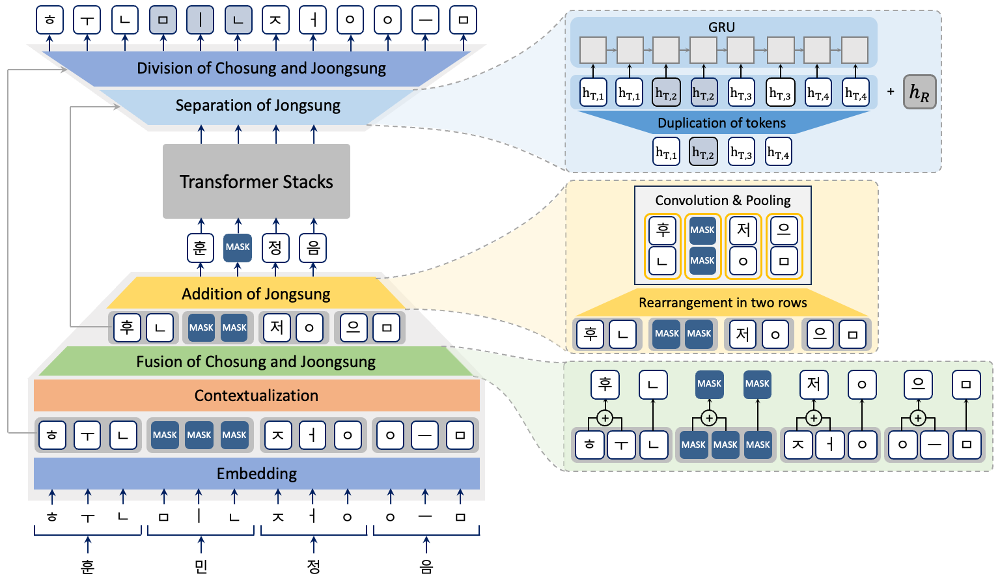
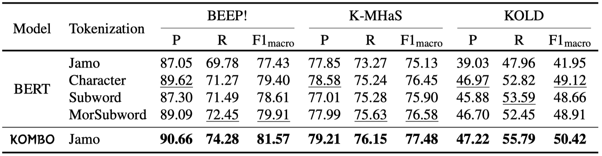

# KOMBO: Korean Character Representations Based on the Combination Rules of Subcharacters


<!-- TABLE OF CONTENTS -->
<h2>Contents</h2>
<ol>
  <li>
    <a href="#environment_installation">Environment Installation</a>
  </li>
  <li>
    <a href="#experimental_settings">Experimental Settings</a>
    <ol>
      <li><a href="#corpus">Corpus</a></li>
      <li><a href="#tokenization_baselines">Tokenization Baselines</a></li>
      <li><a href="#building_vocabulary">Building vocabulary</a></li>
    </ol>
  </li>
  <li>
    <a href="#pretraining">Pre-training</a>
    <ol>
      <li><a href="#pretraining_data">Datasets</a></li>
      <li><a href="#run_pretraining">Run Training</a></li>
      <li><a href="#pretrained_models">Baselines</a></li>
    </ol>
  </li>
  <li>
    <a href="#standard_korean_datasets">Standard Korean Datasets</a>
    <ol>
      <li><a href="#nlu_datasets">Datasets</a></li>
      <li><a href="#nlu_finetuning">Fine-tuning</a></li>
    </ol>
  </li>
  <li>
    <a href="#noisy_korean_datasets">Noisy Korean Datasets</a>
    <ol>
      <li><a href="#typo_finetuning">Fine-tuning</a></li>
    </ol>

  </li>
  <li>
    <a href="#toxic_datasets">Toxic Datasets</a>
    <ol>
      <li><a href="#toxic_data">Datasets</a></li>
      <li><a href="#toxic_finetuning">Fine Tuning</a></li>
    </ol>
  </li>
</ol>
<br/>
<br/>

#### Overall illustration of KOMBO where the input is "훈민정음" which has four characters and twelve subcharacters.


<br/>
<br/>

<a id="environment_installation"></a>
## 1. Environment Installation
- Create your virtual environment.
  ```bash
  conda create -n {your_env} python=3.8
  conda activate {your_env}
  
  pip install --upgrade pip
  ```
- Set the experiment environments.
  - Install the libraries including MeCab. (When you install the MeCab, you might have to join with a root account.)
  ```bash
  bash bash_scripts/installation/env_setting.sh
  ```
<br/>


<a id="experimental_settings"></a>
## 2. Experimental Settings
<a id="corpus"></a>
### i. Corpus

* Dataset preprocessing

  | Corpus                   | Remove HTML tags  | Remove Empty space  | Punctuation Mapping  | ONLY_REMAIN (Korean/English/Punct)          |
  | :----------------------: | :---------------: | :-----------------: | :------------------: | :----------------------------------------:  |
  | Korean Wiki              | O                 | O                   | O                    | O <br/>(for building vocabulary)            |
  | English Wiki             | O                 | O                   | X                    | X                                           |
  | Namu Wiki                | O                 | O                   | O                    | O <br/>(same as Korean Wiki)                |


* The corpus used for building vocabulary and training BPE models is as follows, which was extracted and refined via [attardi/wikiextractor](https://github.com/attardi/wikiextractor).<br/>
  > Notice)<br/>
  > To reproduce the baseline, we use the 0.1 version of the wikiextractor.<br/>
  > We use the latest version of the wiki dump datasets for both Korean and English. We use the data dated 20220923. <br/>
  > You can download the dump data [here](write_your_repository).
  
  - Korean Wikipedia: <https://dumps.wikimedia.org/kowiki>
  - English Wikipedia: <https://dumps.wikimedia.org/enwiki>
  <br/>
  
  
  ```bash
  python -m wikiextractor.WikiExtractor {Wiki dump file path} -o {output dir}
  ```
  ```bash
  cat {otuput_dir}/*/* > {final output_file}.txt
  ```
  
* After applying the wikiextractor to wiki dump data, we appy the [clean_str.py](tokenization/scripts/clean_str.py) for preprocessing the corpus.<br/>
  It returns the **clean-{output_file}.txt**
  ```bash
  python tokenization/bash_scripts/clean_str.py \
  --lang ko --corpus_type wiki \
  --input_corpus datasets/wiki/wikiextracted/ko-wiki-20220923.txt
  ```
  
* You can also download and preprocess all datasets at once.
  ```bash
  bash install_pipeline.sh
  ```
  If you want to do each steps separately, then you just follow the below steps.<br/>
  - Wiki dataset
    ```bash
    bash bash_scripts/installation/download_wiki.sh

    bash bash_scripts/installation/clean_wiki.sh
    ```
  - AIHub news dataset
    ```bash
    bash bash_scripts/installation/download_aihub.sh

    bash bash_scripts/installation/clean_aihub.sh
    ```
  - Namu Wiki dataset
    ```bash
    bash bash_scripts/installation/download_namu.sh

    bash bash_scripts/installation/clean_namu.sh
    ```
  - NLU task datasets
    ```bash
    bash bash_scripts/installation/download_tasks.sh
    ```

<a id="tokenization_baselines"></a>
### ii. Tokenization Baselines 

* There are 13 tokenization strategies for Korean. See [here](tokenization/) to prepare and use each strategy.
  
  * **Stroke** - 130
  * **Cji** - 136
  * **BTS** - 112
  * **Jamo(Consonant and Vowel)** - 170
  * **Character(Syllable)** - 2k
  * **Morpheme** - 32k - using MeCab-ko
  * **Subword** - 32k
  * **Morpheme-aware Subword** - 32k
  * **Word** - 64k - using Moses
  * **KOMBO(Stroke)** - 130
  * **KOMBO(Cji)** - 136
  * **KOMBO(BTS)** - 112
  * **KOMBO(Jamo)** - 170


<a id="building_vocabulary"></a>
### iii. Building vocabulary

- This return the <code>tok.vocab</code> and <code>fairseq.vocab</code> (and <code>tok.model</code> @subword, morpphemeSubword) <br/>
  ```bash
  python tokenization/scripts/build_vocab.py \
  --tok_type en --tok_name subword --vocab_size 32000 \
  --config_path tokenization/utils/tok_info.cfg \
  --input_corpus datasets/wiki/wikiextracted/clean-en-wiki-20220923.txt \
  --output_dir tokenization/resources/ \
  --n_jobs 20  
  ```
  You can also build all vocabularies with [installation code](bash_scripts/tokenization/run_build_vocab.sh).
  ```bash
  bash bash_scripts/tokenization/run_build_vocab.sh
  ```

<br/>
<br/>

<a id="pretraining"></a>
## 3. Pre-training

<a id="pretraining_data"></a>
### i. Datasets

- Because the Korean Wiki corpus(20220923) (753 MB) is not enough in volume for the pre-training purpose, we additionally downloaded the recent dump of [Namuwiki corpus(20190312) (5.5 GB)](https://namu.wiki/w/%EB%82%98%EB%AC%B4%EC%9C%84%ED%82%A4:%EB%8D%B0%EC%9D%B4%ED%84%B0%EB%B2%A0%EC%9D%B4%EC%8A%A4%20%EB%8D%A4%ED%94%84) and extracted plain texts using [Namu Wiki Extractor](https://github.com/jonghwanhyeon/namu-wiki-extractor/tree/4d864d2f7da1d4cb767c22d82f91fe2912007e4b) with adding document seperation(<code>'\n'</code>) per article.
  ```bash
  python utils/namuwiki_extract.py --input_corpus datasets/namuwiki/raw/namuwiki_20200302.json --output_dir datasets/namuwiki/extracted
  ```

- Then, we [preprocess](pretraining/utils/clean_corpus.py) the corpus as we mentioned above. It returns the file name pattern like "clean-doc-*.txt"<br/>
  ```bash
  python pretraining/utils/clean_corpus.py --input_corpus {CORPUS}


  # CORPUS = { kowiki, namuwiki }
  ```
- Concatenate the Korean Wiki corpus and the Namu Wiki corpus.
  ```bash
  mkdir datasets/pretraining
  
  cat datasets/namuwiki/extracted/clean-doc-namuwiki_20200302.txt datasets/wiki/wikiextracted/clean-doc-ko-wiki-20220923.txt > datasets/pretraining/concatenated.txt
  ```


<a id="run_pretraining"></a>
### ii. Run Training

For  each  tokenization  strategy,  pre-training of BERT-Base model (Devlin et al., 2019)  was  performed with a Huggingface and Pytorch library.
- Trim original datasets (remove doc seperator, space) and make the corpus and labels for NSP task for each tasks. It returns the `sentence_as.txt`, `sentence_bs.txt`, and `nsp_labels.txt`. <br/>
We preprocessed the input segments by referring the [official BERT code](https://github.com/google-research/bert/blob/master/create_pretraining_data.py).<br/>
    
    
- We set the training hyper-parameters of all models as follows:<br/>
`batch_size=128`, `max_sequence_length=128`, `learning_rate=5e-5`, `total_steps=1_000_000` `warm_up_steps=10_000`
    
- Run Training
  * BERT-base
  ```bash
  python pretraining/scripts/run_pretraining.py --random_seed 42 \
  --tok_type ${TOKENIZER} --tok_vocab_size ${TOK_VOCAB} \
  --model_name bert-base \
  --max_seq_len 128 --batch_size 128 --gradient_accumulation_steps 1 \
  --learninig_rate 5e-05 --max_grad_norm 1. --total_steps 1_000_000 --num_warmup_steps 10_000 \

  # TOKENIZER = {stroke, cji, bts, jamo, char, morpheme, subword, morphemeSubword, word}
  # TOK_VOCAB = {200, 2k, 4k, 8k, 16k, 32k, 64k}
  ```


  * KOMBO-base
  ```bash
  python pretraining/scripts/run_pretraining.py --random_seed 42 \
  --tok_type ${TOKENIZER} --tok_vocab_size 200 \
  --model_name kombo-base --mlm_unit ${MASKING} --jamo_fusion ${COMBINATION} --jamo_trans_layer 3 \
  --upsampling ${RESTORATION} --upsampling_residual True \
  --max_seq_len 128 --batch_size 128 --gradient_accumulation_steps 1 \
  --learninig_rate 5e-05 --max_grad_norm 1. --total_steps 1_000_000 --num_warmup_steps 10_000 \
  
  # TOKENIZER = {stroke_var, cji_var, bts_var, jamo_distinct}
  # MASKING = {token, character}
  # COMBINATION = {
  #   KOMBO: trans_gru_conv1,
  #   KOMBO w/o contextualization: conv1,
  #   KOMBO w/ (2x2 kernel): trans_gru_conv,
  #   KOMBO w/ (2x3 kernel): trans_gru_conv3,
  #   KOMBO w/ (2x1 + 2x2 kernel): conv2,
  #   KOMBO w/ attention_pooling: trans_attention_pool,
  #   KOMBO w/ linear_pooling: trans_linear_pool,
  # }
  # RESTORATION = {
  #   linear, repeat_linear, gru, repeat_gru
  # }
  # Notice) You should set `ignore_structure` option to "True", when you reconstruct the downsampling methods of Funnel(attention_pooling) or Hourglass(linear_pooling) Transformer in KOMBO.
  ```


  If you want to resume the pre-training, you should set the save_dir to the directory of checkpoint.
  
<a id="pretrained_models"></a>
### iii. Baselines
You can find the pre-trained models [here](write_your_repository).

<br/>
<br/>


<a id="standard_korean_datasets"></a>
## 4. Standard Korean Datasets
#### Performance of various tokenization methods for PLMs on standard Korean datasets.


<a id="nlu_datasets"></a>
### i. Datasets
- For each tokenization strategy, fine-tuning of 5 Korean NLU tasks, KorQuAD, KorNLI, KorSTS, NSMC, and PAWS_X, was performed.
  - KorQuAD 1.0 ([Lim et al., 2019](https://arxiv.org/abs/1909.07005))
  - KorNLI ([Ham et al., 2020](https://aclanthology.org/2020.findings-emnlp.39/))
  - KorSTS ([Ham et al., 2020](https://aclanthology.org/2020.findings-emnlp.39/))
  - NSMC ([Park, 2016](https://github.com/e9t/nsmc))
  - PAWS-X ([Yang et al., 2019](https://aclanthology.org/D19-1382/))
- We preprocess the datasets to remain only two languages, such as Korean and English with puncutations. Then, to fully concentrate on Korean, we convert the English into Korean using [g2pK](https://github.com/Kyubyong/g2pK), which is the convertor transforming from graphemes to phoneme and vice versa.


<a id="nlu_finetuning"></a>
### ii. Fine-tuning
- All tasks shared the files corresponding to [bert config](pretraining/utils/bert_config.json) or [kombo_config](pretraining/utils/kombo_config.json), [models](pretraining/srcs/models.py), [trainer](nlu_tasks/srcs/task_trainer.py), and [running code](nlu_tasks/scripts/run_finetuning.py) across all tasks and we set the individual [config and data_preprocessing code](nlu_tasks/data_configs/) files for each tasks. <br/>
- You can run the fine-tuning of the models for each tasks you want as follows:

  * BERT-base
  ```bash
  python nlu_tasks/scripts/run_finetuning.py --random_seed 42 \
  --tok_type ${TOKENIZER} --tok_vocab_size ${TOK_VOCAB} \
  --model_name bert-base \
  --optimizer adamw --lr_scheduler linear \
  --save_dir ${SAVE} --task_name ${TASK} \
  --remain_lang ko_en_punc --do_hangeulize True --data_remove True
  
  # TOKENIZER = {stroke, cji, bts, jamo, char, morpheme, subword, morphemeSubword, word}
  # TOK_VOCAB = {200, 2k, 4k, 8k, 16k, 32k, 64k}
  # SAVE = [Your checkpoint of the model. e.g., "logs/bert-base/morphemeSubword_ko_wiki_32k/pretraining/128t_128b_1s_5e-05lr_42rs/ckpt"]
  # TASK = {KorQuAD, KorNLI, KorSTS, NSMC, PAWS_X}
  ```

  
  * KOMBO-base
  ```bash
  python nlu_tasks/scripts/run_finetuning.py --random_seed 42 \
  --tok_type ${TOKENIZER} --tok_vocab_size 200 \
  --model_name kombo-base --mlm_unit ${MASKING} --jamo_fusion ${COMBINATION} --jamo_trans_layer 3 \
  --upsampling ${RESTORATION} --upsampling_residual True \
  --optimizer adamw --lr_scheduler linear \
  --save_dir ${SAVE} --task_name ${TASK} \
  --remain_lang ko_en_punc --do_hangeulize True --data_remove True
  
  # TOKENIZER = {stroke_var, cji_var, bts_var, jamo_distinct}
  # MASKING = {token, character}
  # COMBINATION = {
  #   KOMBO: trans_gru_conv1,
  #   KOMBO w/o contextualization: conv1,
  #   KOMBO w/ (2x2 kernel): trans_gru_conv,
  #   KOMBO w/ (2x3 kernel): trans_gru_conv3,
  #   KOMBO w/ (2x1 + 2x2 kernel): conv2,
  #   KOMBO w/ attention_pooling: trans_attention_pool,
  #   KOMBO w/ linear_pooling: trans_linear_pool,
  # }
  # RESTORATION = {
  #   linear, repeat_linear, gru, repeat_gru
  # }
  # SAVE = [Your checkpoint of the model. e.g., "logs/kombo-base/jamo_distinct_ko_200/pretraining/span-character-mlm_jamo-trans3_gru_conv1-cjf_repeat_gru-up-res_128t_128b_1s_5e-05lr_42rs/ckpt"]
  # TASK = {KorQuAD, KorNLI, KorSTS, NSMC, PAWS_X}
  
  # Notice) You should set `ignore_structure` option to "True", when you reconstruct the downsampling methods of Funnel(attention_pooling) or Hourglass(linear_pooling) Transformer in KOMBO.
  ```
<br/>
<br/>


<a id="noisy_korean_datasets"></a>
## 5. Noisy Korean Datasets
#### Performance of the models on NLU tasks with typological errors.


<a id="typo_finetuning"></a>
### i. Fine-tuning
- These are basically the same as Korean NLU tasks, except the <ins>typo type</ins> and <ins>typo rates</ins> settings.
- We implement four different typological error generating methods, such as Insert, Transpose, Substitue, and Delete. <br/>
  You should set the `typo_type` among random, insert, transpose, substitute, and delete.

- We conduct this experiment <ins>using pre-trained language models on Korean NLU tasks</ins> and <ins>only do test</ins> on typo environments.
- You can run the fine-tuning of the models for each tasks you want as follows:
  
  * BERT-base
  ```bash
  python nlu_tasks/scripts/run_finetuning.py --random_seed 42 \
  --tok_type ${TOKENIZER} --tok_vocab_size ${TOK_VOCAB} \
  --model_name bert-base \
  --optimizer adamw --lr_scheduler linear \
  --save_dir ${SAVE} --task_name ${TASK} \
  --remain_lang ko_en_punc --do_hangeulize True --data_remove True \
  --typo_type ${TYPO} --typo_rates 0.0_0.05_0.10_0.15_0.20_0.25_0.30_0.35_0.40
  
  # TOKENIZER = {stroke, cji, bts, jamo, char, morpheme, subword, morphemeSubword, word}
  # TOK_VOCAB = {200, 2k, 4k, 8k, 16k, 32k, 64k}
  # SAVE = [Your checkpoint of the model. e.g., "logs/bert-base/morphemeSubword_ko_wiki_32k/nlu_tasks/KorNLI/128t_16b_4s_3e_0.0001lr_2739rs/ckpt"]
  # TYPO = {random, insert, transpose, substitute, delete}
  # TASK = {KorQuAD, KorNLI, KorSTS, NSMC, PAWS_X}
  ```

  
  * KOMBO-base
  ```bash
  python nlu_tasks/scripts/run_finetuning.py --random_seed 42 \
  --tok_type ${TOKENIZER} --tok_vocab_size 200 \
  --model_name kombo-base --mlm_unit ${MASKING} --jamo_fusion ${COMBINATION} --jamo_trans_layer 3 \
  --upsampling ${RESTORATION} --upsampling_residual True \
  --optimizer adamw --lr_scheduler linear \
  --save_dir ${SAVE} --task_name ${TASK} \
  --remain_lang ko_en_punc --do_hangeulize True --data_remove True \
  --typo_type ${TYPO} --typo_rates 0.0_0.05_0.10_0.15_0.20_0.25_0.30_0.35_0.40
  
  # TOKENIZER = {stroke_var, cji_var, bts_var, jamo_distinct}
  # MASKING = {token, character}
  # COMBINATION = {
  #   KOMBO: trans_gru_conv1,
  #   KOMBO w/o contextualization: conv1,
  #   KOMBO w/ (2x2 kernel): trans_gru_conv,
  #   KOMBO w/ (2x3 kernel): trans_gru_conv3,
  #   KOMBO w/ (2x1 + 2x2 kernel): conv2,
  #   KOMBO w/ attention_pooling: trans_attention_pool,
  #   KOMBO w/ linear_pooling: trans_linear_pool,
  # }
  # RESTORATION = {
  #   linear, repeat_linear, gru, repeat_gru
  # }
  # SAVE = [Your checkpoint of the model. e.g., "logs/kombo-base/jamo_distinct_ko_200/nlu_tasks/KorNLI/span-character-mlm_jamo-trans3_gru_conv1-cjf_repeat_gru-up-res_512t_16b_4s_3e_5e-05lr_42rs/ckpt"]
  # TYPO = {random, insert, transpose, substitute, delete}
  # TASK = {KorQuAD, KorNLI, KorSTS, NSMC, PAWS_X}
  
  # Notice) You should set `ignore_structure` option to "True", when you reconstruct the downsampling methods of Funnel(attention_pooling) or Hourglass(linear_pooling) Transformer in KOMBO.
  ```

<br/>
<br/>


<a id="toxic_datasets"></a>
## 6. Toxic Data
#### Evaluation results for the robustness of the models on three toxic datasets.


<a id="toxic_data"></a>
### i. Datasets
- we experiment on three Korean offensive language datasets. BEEP! dataset is a binary classification task. K-MHaS and KOLD both are the multi-label classification tasks.
  - BEEP! ([Moon et al., 2020](https://aclanthology.org/2020.socialnlp-1.4/))
  - K-MHaS ([Lee et al., 2022](https://aclanthology.org/2022.coling-1.311/))
  - KOLD ([Jeong et al., 2022](https://aclanthology.org/2022.emnlp-main.744/))

<a id="toxic_finetuning"></a>
### ii. Fine-tuning
- You can run the fine-tuning of the models for each tasks you want as follows:
  
  * BERT-base
  ```bash
  python nlu_tasks/scripts/run_finetuning.py --random_seed 42 \
  --tok_type ${TOKENIZER} --tok_vocab_size ${TOK_VOCAB} \
  --model_name bert-base \
  --optimizer adamw --lr_scheduler linear \
  --save_dir ${SAVE} --task_name ${TASK} \
  --remain_lang ko_en_punc --do_hangeulize True --data_remove False
  
  # TOKENIZER = {stroke, cji, bts, jamo, char, morpheme, subword, morphemeSubword, word}
  # TOK_VOCAB = {200, 2k, 4k, 8k, 16k, 32k, 64k}
  # SAVE = [Your checkpoint of the model. e.g., "logs/bert-base/morphemeSubword_ko_wiki_32k/pretraining/128t_128b_1s_5e-05lr_42rs/ckpt"]
  # TASK = {BEEP, KMHaS, KOLD}
  ```
  
  
  * KOMBO-base
  ```bash
  python nlu_tasks/scripts/run_finetuning.py --random_seed 42 \
  --tok_type ${TOKENIZER} --tok_vocab_size 200 \
  --model_name kombo-base --mlm_unit ${MASKING} --jamo_fusion ${COMBINATION} --jamo_trans_layer 3 \
  --upsampling ${RESTORATION} --upsampling_residual True \
  --optimizer adamw --lr_scheduler linear \
  --save_dir ${SAVE} --task_name ${TASK} \
  --remain_lang ko_en_punc --do_hangeulize True --data_remove False
  
  # TOKENIZER = {stroke_var, cji_var, bts_var, jamo_distinct}
  # MASKING = {token, character}
  # COMBINATION = {
  #    KOMBO: trans_gru_conv1,
  # }
  # RESTORATION = {
  #    linear, repeat_linear, gru, repeat_gru
  # }
  # SAVE = [Your checkpoint of the model. e.g., "logs/kombo-base/jamo_distinct_ko_200/pretraining/span-character-mlm_jamo-trans3_gru_conv1-cjf_repeat_gru-up-res_128t_128b_1s_5e-05lr_42rs/ckpt"]
  # TASK = {BEEP, KMHaS, KOLD}
  
  # Notice) You should set `ignore_structure` option to "True", when you reconstruct the downsampling methods of Funnel(attention_pooling) or Hourglass(linear_pooling) Transformer in KOMBO.
  ```

<br/>
<br/>


## Citation

```plain
.
```

## Acknowledgements

.
